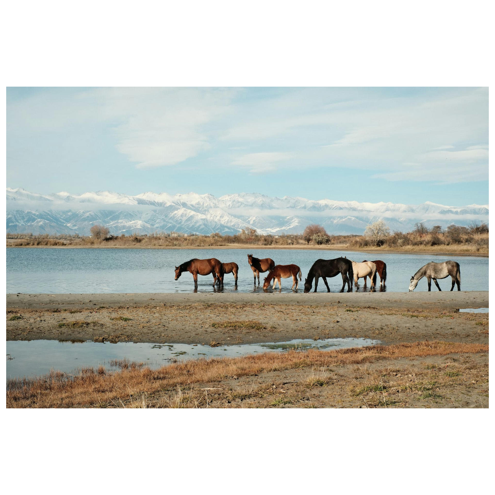

# Framy

Framy is a command-line tool for adding frames to images. It allows you to specify the color and the padding of frames.

## Installation

### via Homebrew

```sh
brew tap HikaruTakakura/framy
brew install framy
```

## Usage

```sh
# add default frame
framy images/horses.jpg --outdir images
```

```sh
# add black frame
framy images/horses.jpg --outdir images --color 000000 --suffix _black
```

| path                    | image                                               |
| ----------------------- | --------------------------------------------------- |
| images/horses.jpg       |        |
| images/horses_framy.jpg |  |
| images/horses_black.jpg |  |

```sh
# add frames only to images which have 'favorite' tag using pipeline
DIR=./images && mdfind -onlyin $DIR "kMDItemUserTags == favorite" | framy --outdir "${DIR}/_framy"

tree ./images
./images
├── _framy
│   ├── dog_framy.jpg
│   └── cat_framy.jpg
├── dog.jpg
├── ogre.jpg
└── cat.jpg
```

## License

This project is released under the MIT license. For details, please refer to the `LICENSE` file.
